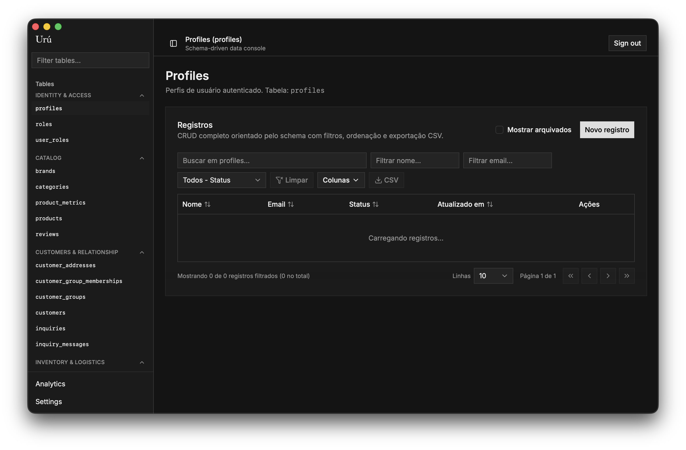
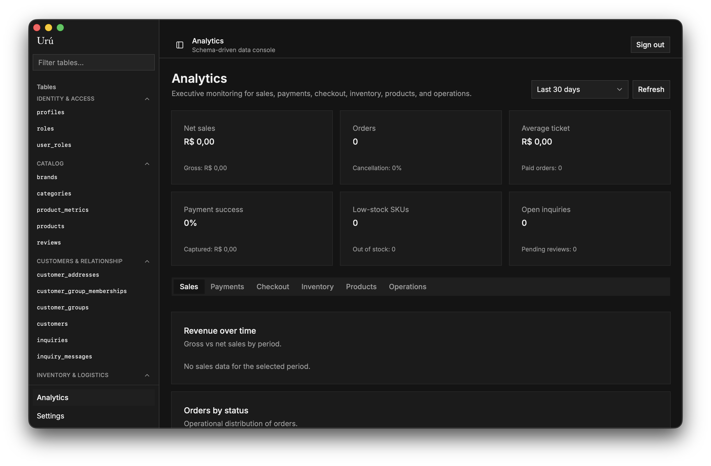

# Ops

Ops is a Tauri desktop operations manager backed by Supabase. It provides a schema-driven workspace for product catalog, customers, inventory, orders, payments, shipments, support operations, and analytics without adding a local business database to the desktop app.

The repository is a single-package desktop/web app. The renderer is built with React, TanStack Router, TanStack Table, Tailwind CSS, and Supabase JS. The native shell is built with Tauri 2 and Rust, and it stays intentionally thin: business data access goes through Supabase `from`, `rpc`, and `auth` calls.

## Current Status

- Active desktop app.
- Medium-sized single application, not a monorepo.
- Supabase-only business data layer.
- No local SQLite, `sqlx`, or Tauri SQL plugin usage.
- No root-level Supabase migrations directory is present in this checkout.
- No first-party HTTP API server is present in this checkout.

## Main Features

- Runtime Supabase connection onboarding for installed desktop usage.
- Supabase Auth sign-in, sign-out, first-admin bootstrap, and role lookup.
- Schema-driven data console for 31 Supabase tables.
- CRUD forms generated from `src/lib/schema-registry.ts`.
- Relation selectors, table filtering, sorting, pagination, column visibility, and CSV export.
- Join editors for user roles, customer groups, product tags and sizes, order items, transaction items, and shipment items.
- Transactional RPC actions for order status updates and inventory reserve/release flows.
- Analytics dashboard backed by Supabase RPCs for sales, payments, checkout, inventory, products, and operations.
- Tauri Store based local settings and runtime connection persistence.
- Tauri updater integration with GitHub release artifacts.
- Browser translation protection through `notranslate` metadata and `translate="no"` on the document body.

## Technology Stack

| Area | Technology |
| --- | --- |
| Desktop shell | Tauri 2, Rust 2021 |
| Renderer | React 19, TypeScript, Vite, TanStack Start/Router |
| Data tables | TanStack Table |
| Styling | Tailwind CSS 4, shadcn-style components, Radix UI, Base UI, lucide-react |
| Charts | Recharts |
| Local UI settings | Tauri Store, browser localStorage fallback. `zustand` is installed but no active source usage was identified. |
| Backend service | Supabase Auth, Postgres tables, RLS, RPC functions |
| Tests | Vitest |
| Release automation | GitHub Actions, Tauri updater artifacts |

## Screenshots

<p align="center">
  
  <br />
  <em>Schema-driven data console with table navigation.</em>
</p>

<p align="center">
  
  <br />
  <em>Analytics dashboard with business metrics.</em>
</p>

## Project Structure

```text
ops/
|-- src/
|   |-- routes/                  # TanStack Router routes
|   |-- components/app/          # Product-specific app and onboarding components
|   |-- components/ui/           # shadcn-style UI primitives and DataTable
|   |-- lib/
|   |   |-- supabase/            # Supabase client, auth, runtime config, errors
|   |   |-- db/repositories/     # Supabase table and RPC repositories
|   |   |-- analytics/           # Analytics range helpers
|   |   `-- schema-registry.ts   # Table metadata that drives the console UI
|   `-- types/                   # Supabase-generated and domain TypeScript types
|-- src-tauri/
|   |-- src/lib.rs               # Tauri setup and native commands
|   |-- tauri.conf.json          # Desktop window, bundle, and updater config
|   `-- capabilities/default.json
|-- docs/                        # Project documentation
|-- scripts/reset-config.sh      # Local runtime config reset helper
|-- .github/workflows/           # Release automation
`-- install.sh                   # macOS release installer
```

## Runtime Model

Ops does not ship with a local business database. The desktop renderer resolves a Supabase connection in this order:

1. One-time bootstrap payload consumed by the Tauri command `consume_supabase_bootstrap_payload`.
2. Saved runtime connection persisted through Tauri Store under `supabase.runtime.connection`.
3. Development-only Vite environment fallback from `.env.local`.

In a browser-only development session, runtime config falls back to localStorage under `ops.supabase.runtime.connection`. In production Tauri builds, environment fallback is disabled unless the app is running in development mode.

## Application Routes

| Route | Purpose |
| --- | --- |
| `/` | Redirects to onboarding, login, or analytics depending on runtime config and session state. |
| `/onboarding` | Runtime Supabase connection setup and first administrator bootstrap. |
| `/login` | Supabase Auth email/password sign-in. |
| `/analytics` | RPC-backed dashboard for sales, payments, checkout, inventory, products, and operations. |
| `/tables/$table` | Schema-driven CRUD console for configured Supabase tables. |
| `/products` | Redirects to `/tables/products`. |
| `/orders` | Redirects to `/tables/orders`. |
| `/inventory` | Redirects to `/tables/inventory_levels`. |
| `/settings` | Runtime connection, local settings, identity context, and app update checks. |

## Prerequisites

- Node.js 20 or newer.
- pnpm.
- Rust toolchain compatible with Tauri 2.
- Tauri system dependencies for your operating system.
- A Supabase project with the tables and RPC functions described by `src/types/database.ts`.

The Supabase schema itself is not stored in this checkout. `src/types/database.ts` is the local TypeScript contract used by the app, but migrations and seed/reset scripts are not present here.

## Installation

```bash
pnpm install
```

Optional development fallback config can be created from `.env.example`:

```bash
cp .env.example .env.local
```

`.env.local` supports:

```text
VITE_SUPABASE_URL=
VITE_SUPABASE_PUBLISHABLE_DEFAULT_KEY=
```

Use only publishable/default Supabase keys in client-side configuration. Do not place service-role keys in this app.

## Local Development

The package scripts define:

```bash
pnpm dev:web
pnpm dev
```

- `pnpm dev:web` starts the renderer only on port `3000`.
- `pnpm dev` starts Tauri development and uses `npm run dev:web` as its configured frontend command in `src-tauri/tauri.conf.json`.

This documentation update intentionally did not run development, build, or preview commands.

## Available Scripts

| Script | Purpose |
| --- | --- |
| `pnpm install` | Install Node dependencies. |
| `pnpm dev:web` | Start the Vite/TanStack renderer development server. |
| `pnpm dev` | Start the Tauri desktop app in development mode. |
| `pnpm build` | Build the renderer into `.output/public`. |
| `pnpm preview` | Preview the built renderer. |
| `pnpm test` | Run Vitest tests. |
| `pnpm lint` | Run ESLint. |
| `pnpm format` | Run the configured Prettier CLI. The package script does not pass a target path. |
| `pnpm check` | Runs `prettier --write .` and `eslint --fix`; this command mutates files. |

## Testing

Tests live next to TypeScript modules and use Vitest. Current coverage focuses on:

- Runtime Supabase config resolution and persistence.
- Supabase client cache/reset behavior.
- Schema registry coverage for all 31 table contracts.
- Hidden join route redirects.
- Table CRUD payload normalization, archive behavior, and lookup labels.
- Console read RPC fallback behavior.
- Console join RPC payload normalization.
- CSV helpers used by the data table export.

Run tests with:

```bash
pnpm test
```

## Build and Release

The renderer build script is:

```bash
pnpm build
```

Tauri packaging is configured in `src-tauri/tauri.conf.json`. The GitHub Actions workflow `.github/workflows/release-macos.yml` builds macOS bundles for:

- `aarch64-apple-darwin` on `macos-14`
- `x86_64-apple-darwin` on `macos-13`

The workflow uploads `.zip`, `.app.tar.gz`, `.app.tar.gz.sig`, and `latest.json` release assets. The Tauri updater endpoint points to:

```text
https://github.com/polterware/ops/releases/latest/download/latest.json
```

See `docs/deployment.md` for release details and current unknowns.

## Documentation

- `docs/getting-started.md`: local setup and runtime configuration.
- `docs/architecture.md`: technical architecture and data flow.
- `docs/database.md`: Supabase data contract and schema-driven UI model.
- `docs/api.md`: internal Supabase and Tauri command contracts.
- `docs/deployment.md`: release and updater workflow.
- `docs/troubleshooting.md`: common setup and runtime issues.
- `SECURITY.md`: project-specific security considerations.

## Known Limitations

- The Supabase schema, migrations, and seed/reset workflow are not present in this checkout.
- RLS policies are assumed by the frontend and type contract, but policy SQL cannot be reviewed from this repository alone.
- The app stores publishable Supabase runtime connection data locally for desktop usage.
- `src-tauri/tauri.conf.json` currently sets `app.security.csp` to `null`.
- Tauri app data can survive reinstall/uninstall and may need manual reset with `scripts/reset-config.sh`.
- Signing/notarization details are not fully documented in the current codebase.

## License

This project is licensed under the [GNU General Public License v3.0](LICENSE).
